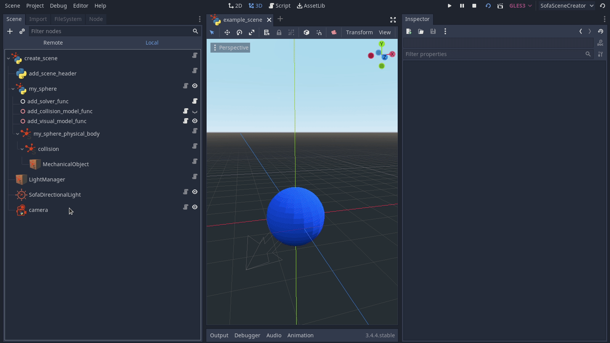
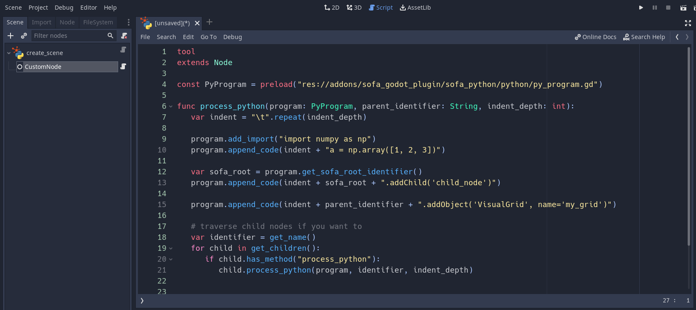

# SOFA-Godot plugin

1. [Prerequisites](#prerequisites)
2. [Setup](#setup)
3. [Tutorial](#tutorial-creating-a-sofa-scene-using-the-godot-plugin)
4. [Components](#components)
5. ["How-to"](#how-to)
6. [Example scenes](#examples)
## Prerequisites

* SOFA-Godot is a plugin for the [Godot game engine](https://godotengine.org).
It was tested on Ubuntu 20.04 with Godot standard versions `3.5.1` and `3.4.5`.
* You can download the linux versions of Godot [here](https://godotengine.org/download/linux).
* Make sure you've build/installed [SOFA](https://github.com/sofa-framework/sofa) and [SofaPython3](https://github.com/sofa-framework/SofaPython3) within a [conda environment](https://docs.conda.io/en/latest/).
You can follow the instructions [here](https://gitlab.ipr.kit.edu/sofa-ri/sofa_env/-/blob/main/docs/source/setting_up_sofa.rst).
* If you want to use components from [sofa_env](https://gitlab.ipr.kit.edu/sofa-ri/sofa_env) you also need to [install sofa_env](https://gitlab.ipr.kit.edu/sofa-ri/sofa_env#getting-started) within your conda environment.

## Setup
- Clone this project into the `res://addons/` folder of your Godot project and [enable](https://docs.godotengine.org/en/stable/tutorials/plugins/editor/installing_plugins.html) the plugin like any other Godot plugin (`Project -> Project Settings -> Plugins`).
   
- The folder structure should look as follows:
   ```
   your_project
   ├── addons
   │   ├── sofa_godot_plugin
   │   ├── other_plugin_1
   │   ├── other_plugin_2
   │   └── ...
   ├── your_project_folder_1
   ├── your_project_folder_2
   └── ...
   ```
- You can also have a look at some [examplary scenes](https://gitlab.ipr.kit.edu/sofa-godot/sofa_env_godot_scenes).
## Tutorial: Creating a SOFA scene using the Godot plugin

1. Create a new Godot scene.
2. Add a node of type `SofaPythonRoot` as scene root: 
3. Select the root node (`'create_scene'`) and use the Inspector tab to adjust
   * the path to your SOFA binary, e.g. `~/sofa/build/install/bin/runSofa`,
   * the path to your conda binary, e.g. `~/miniconda3/condabin/conda`, and
   * the name of the conda environment where SofaPython3 was installed.
   
   

   
4. Save the scene and press the `F6` key to build the SOFA scene description.\
   Note that by default the resulting python file will be stored at `/tmp/sofa_python_scene.py`.\
   The Godot scene graph depcited

   

   will produce the following - SofaPython3 compatible - code:
   ``` python
   import Sofa
   import Sofa.Core

   PLUGINS = []

   def createScene(root_node: Sofa.Core.Node):
      scene_description = {"root_node": root_node}

      return scene_description
   ```
5. Feel free to extend the scene graph with dedicated nodes provided by this plugin.\
   For example, let's add a blue sphere using the `ControllableRigidObject` [template](https://gitlab.ipr.kit.edu/sofa-ri/sofa_env/-/blob/main/docs/source/sofa_templates.rst) from `sofa_env`:

   

6. In order to access the sphere later on, i.e. during SOFA runtime, we may assign an identifier (`my_sphere`) to the `ControllableRigidObject` or add it to the `scene_description` dictionary:

   

   The resulting python code looks like this:
   ``` python
   from functools import partial

   import Sofa
   import Sofa.Core

   from sofa_env.sofa_templates.scene_header import SCENE_HEADER_PLUGIN_LIST, add_scene_header
   from sofa_env.sofa_templates.rigid import RIGID_PLUGIN_LIST, ControllableRigidObject
   from sofa_env.sofa_templates.visual import add_visual_model

   PLUGINS = SCENE_HEADER_PLUGIN_LIST + RIGID_PLUGIN_LIST

   def createScene(root_node: Sofa.Core.Node):
      scene_description = {"root_node": root_node}

      add_scene_header(
         root_node=root_node,
         plugin_list=PLUGINS,
         collision_detection_method_kwargs={
            "alarmDistance": 1,
            "contactDistance": 0.5
         }
      )

      my_sphere = ControllableRigidObject(
         parent_node=root_node,
         name="my_sphere",
         pose=[0, 0, 0, 0, 0, 0, 1],
         visual_mesh_path="~/meshes/sphere.obj",
         collision_mesh_path="~/meshes/sphere.obj",
         add_visual_model_func=partial(add_visual_model,
            color=(0.039, 0.345, 1, 1)
         )
      )
      scene_description["my_sphere"] = my_sphere

      return scene_description
   ```
7. Let's add some light and a camera to the scene.\
   Note that we're adding a node of type `SofaCoreObject` and modify its `type` property to place a `LightManager` object in the SOFA scene.

   

8. We can use the final scene description
   ``` python
   from functools import partial
   import Sofa
   import Sofa.Core
   from sofa_env.sofa_templates.scene_header import add_scene_header, SCENE_HEADER_PLUGIN_LIST
   from sofa_env.sofa_templates.rigid import ControllableRigidObject, RIGID_PLUGIN_LIST
   from sofa_env.sofa_templates.visual import add_visual_model
   from sofa_env.sofa_templates.camera import Camera, CAMERA_PLUGIN_LIST

   PLUGINS = SCENE_HEADER_PLUGIN_LIST + RIGID_PLUGIN_LIST + CAMERA_PLUGIN_LIST

   def createScene(root_node: Sofa.Core.Node):
      scene_description = {"root_node": root_node}

      add_scene_header(
         root_node=root_node,
         plugin_list=PLUGINS,
         collision_detection_method_kwargs={
            "alarmDistance": 1,
            "contactDistance": 0.5
         }
      )

      my_sphere = ControllableRigidObject(
         parent_node=root_node,
         name="my_sphere",
         pose=[0, 0, 0, 0, 0, 0, 1],
         visual_mesh_path="~/meshes/sphere.obj",
         collision_mesh_path="~/meshes/sphere.obj",
         add_visual_model_func=partial(add_visual_model,
            color=(0.039216, 0.345098, 1, 1),
            handle_seams=False
         )
      )
      scene_description["my_sphere"] = my_sphere

      root_node.addObject(
         "LightManager"
      )

      root_node.addObject(
         "DirectionalLight",
         color=(1, 1, 1, 1),
         direction=(0.707107, 0.707107, 0)
      )

      scene_description["camera"] = Camera(
         root_node=root_node,
         placement_kwargs={
            "position": (0, 0, 10),
            "lookAt": (0, 0, 1),
            "zoomSpeed": 250,
            "panSpeed": 0.1,
            "pivot": 2
         },
         vertical_field_of_view=45,
         z_near=0.05,
         z_far=100,
         width_viewport=640,
         height_viewport=640
      )
      return scene_description
   ```
   as environment for `sofa_env`.\
   For example, the following program code loads our scene and moves the sphere to the left:
   ``` python
   import gym.spaces
   import numpy as np

   from pathlib import Path
   from sofa_env.base import SofaEnv, RenderMode
   from typing import Optional, Tuple, Union

   class ControllableEnv(SofaEnv):
      def __init__(
         self,
         scene_path: Union[str, Path],
         time_step: float = 0.01,
         frame_skip: int = 1,
         render_mode: RenderMode = RenderMode.HUMAN,
         create_scene_kwargs: Optional[dict] = None,
         maximum_velocity: float = 2.0,
      ) -> None:
         super().__init__(
               scene_path,
               time_step=time_step,
               frame_skip=frame_skip,
               render_mode=render_mode,
               create_scene_kwargs=create_scene_kwargs,
         )
         self.action_space = gym.spaces.Box(low=-1.0, high=1.0, shape=(3,), dtype=np.float32)
         self.observation_space = gym.spaces.Box(low=0, high=255, shape=(600, 600, 3), dtype=np.uint8)
         self.maximum_velocity = maximum_velocity

      def _do_action(self, action: np.ndarray) -> None:
         scaled_action = action * self.time_step * self.maximum_velocity
         old_pose = self.scene_creation_result["my_sphere"].get_pose()
         new_pose = old_pose + np.append(scaled_action, np.array([0, 0, 0, 1]))
         self.scene_creation_result["my_sphere"].set_pose(new_pose)

      def step(self, action: np.ndarray) -> Tuple[np.ndarray, float, bool, dict]:
         rgb_observation = super().step(action)
         info = {"sphere_position": self.scene_creation_result["my_sphere"].get_pose()[:3]}
         done = info["sphere_position"][0] <= -5.0
         reward = 10.0 if done else 0.0
         return rgb_observation, reward, done, info

      def reset(self) -> np.ndarray:
         return super().reset()


   if __name__ == "__main__":
      env = ControllableEnv(
         scene_path="/tmp/sofa_python_scene.py",
         render_mode=RenderMode.HUMAN,
      )
      env.reset()
      action = np.array([-1, 0, 0], dtype=np.float32)
      done = False
      try:
         while not done:
               _, done, _, _ = env.step(action)
      except KeyboardInterrupt:
         pass
   ```
   SOFA simulation:

   

## Components
### Supported SOFA components
* [Simulation](https://github.com/sofa-framework/sofa/tree/master/Sofa/framework/Simulation)
   * [Node](sofa_python/sofa_core/sofa_core_node.gd)
   * [Object](sofa_python/sofa_core/sofa_core_object.gd)
   * [RequiredPlugin](sofa_python/sofa_components/simulation/sofa_required_plugin.gd)
* [Constraint](https://github.com/sofa-framework/sofa/tree/master/Sofa/Component/Constraint)
   * [AttachConstraint](sofa_python/sofa_components/constraint/projective/sofa_attach_constraint.gd)
   * [FixedConstraint](sofa_python/sofa_components/constraint/projective/sofa_fixed_constraint.gd)
   * [PartialFixedConstraint](sofa_python/sofa_components/constraint/projective/sofa_partial_fixed_constraint.gd)
* [Select](https://github.com/sofa-framework/sofa/tree/master/Sofa/Component/Engine/Select)
   * [NearestPointROI](sofa_python/sofa_components/engine/select/sofa_nearest_point_roi.gd)
   * [OrientedBoxROI](sofa_python/sofa_components/engine/select/sofa_oriented_box_roi.gd)
   * [SphereROI](sofa_python/sofa_components/engine/select/sofa_sphere_roi.gd)
* [GL](https://github.com/sofa-framework/sofa/tree/master/Sofa/GL/)
   * [DirectionalLight](sofa_components/gl/shader/sofa_directional_light.gd)
* [Visual](https://github.com/sofa-framework/sofa/tree/master/Sofa/Component/Visual)
   * [LineAxis](sofa_python/sofa_components/visual/sofa_line_axis.gd)
   * [VisualGrid](sofa_python/sofa_components/visual/sofa_visual_grid.gd)

### Supported `sofa_env` components
* sofa_templates
   * [camera](https://gitlab.ipr.kit.edu/sofa-ri/sofa_env/-/blob/main/sofa_env/sofa_templates/camera.py)
      * [Camera](sofa_python/sofa_env/camera/sofa_env_camera.gd)
   * [collision](https://gitlab.ipr.kit.edu/sofa-ri/sofa_env/-/blob/main/sofa_env/sofa_templates/collision.py)
      * [add_collision_model](sofa_python/sofa_env/collision/add_collision_model.gd)
   * [deformable](https://gitlab.ipr.kit.edu/sofa-ri/sofa_env/-/blob/main/sofa_env/sofa_templates/deformable.py)
      * [DeformableObject](sofa_python/sofa_env/deformable/deformable_object.gd)
      * [CuttableDeformableObject](sofa_python/sofa_env/deformable/cuttable_deformable_object.gd)
   * [motion_restriction](https://gitlab.ipr.kit.edu/sofa-ri/sofa_env/-/blob/main/sofa_env/sofa_templates/motion_restriction.py)
      * [add_fixed_constraint_in_bounding_box](sofa_python/sofa_env/motion_restriction/add_fixed_constraint_in_bounding_box.gd)
   * [rigid](https://gitlab.ipr.kit.edu/sofa-ri/sofa_env/-/blob/main/sofa_env/sofa_templates/rigid.py)
      * [RigidObject](sofa_python/sofa_env/rigid/rigid_object.gd)
      * [ControllableRigidObject](sofa_python/sofa_env/rigid/controllable_rigid_object.gd)
   * [scene_header](https://gitlab.ipr.kit.edu/sofa-ri/sofa_env/-/blob/main/sofa_env/sofa_templates/scene_header.py)
      * [add_scene_header](sofa_python/sofa_env/scene_header/sofa_env_scene_header.gd)
   * [solver](https://gitlab.ipr.kit.edu/sofa-ri/sofa_env/-/blob/main/sofa_env/sofa_templates/solver.py)
      * [add_solver](sofa_python/sofa_env/solver/add_solver.gd)
   * [visual](https://gitlab.ipr.kit.edu/sofa-ri/sofa_env/-/blob/main/sofa_env/sofa_templates/visual.py)
      * [add_visual_model](sofa_python/sofa_env/visual/add_visual_model.gd)


## "How-to"

### How to expose an existing SOFA object or node in Godot's scene graph?
- Consider the scene we built in the [tutorial](#tutorial-creating-a-sofa-scene-using-the-godot-plugin).

   

- The corresponding scene graph in SOFA looks as follows

   

- Notice the children of the node `my_sphere` within the SOFA scene graph. It is possible to expose these children in Godot as well by using `SofaCoreNode` and `SofaCoreObject` nodes with their property `Sofa Object Instance` set to `expose existing {node, object}` accordingly.

   

- Exposure enables referencing the respective component. For example, we can fix the indices of the `MechanicalObject` below the *collision* node that lie within a specified region of interest.

   


### How to add a SOFA object that has no dedicated Godot counterpart?
You can place a `SofaCoreObject` node within the Godot scene and modify its `type` and `kwargs` properties.
For example, instead of using the dedicated [VisualGrid](sofa_python/sofa_components/visual/sofa_visual_grid.gd) node we can add a `SofaCoreObject` node, set its type to *VisualGrid* and add the necessary arguments.
In theory, one might be able to build an entire SOFA scene in Godot using only nodes of type `SofaCoreNode` and `SofaCoreObject`.
This is analogous to coding up a SOFA scene directly with SofaPython3 using `Sofa.Core.Node::addObject` and `Sofa.Core.Node::addChild`.
However, dedicated Godot nodes provide helpful visualizations to the developer, e.g. the provided VisualGrid node comes with an interactive visualization of the grid.


The corresponding python code will look like
``` python
def createScene(root_node: Sofa.Core.Node):
   # ...
   root_node.addObject(
      "VisualGrid",
      name="my_visual_grid",
      plane="y",
      size=30,
   )
   # ...
   return scene_description
```

### How to produce python code within a Godot node?

All child nodes of a `SofaPythonRoot` node will be traversed.
On any child that has a method named `process_python` said method will be called.
It takes an argument *program* of type `PyProgram` which may be used to add arbitrary lines of python code.

For example,

 

a Godot scene of the following structure
```
create_scene: SofaPythonRoot
├── CustomNode
```
where `CustomNode` has the following script attached:
``` gdscript
tool
extends Node

const PyProgram = preload("res://addons/sofa_godot_plugin/sofa_python/python/py_program.gd")

func process_python(program: PyProgram, parent_identifier: String, indent_depth: int):
   var indent = "\t".repeat(indent_depth)

   program.add_import("import numpy as np")
   program.append_code(indent + "a = np.array([1, 2, 3])")

   var sofa_root = program.get_sofa_root_identifier()
   program.append_code(indent + sofa_root + ".addChild('child_node')")

   program.append_code(indent + parent_identifier + ".addObject('VisualGrid', name='my_grid')")

   # traverse child nodes if you want to
   var identifier = get_name()
   for child in get_children():
      if child.has_method("process_python"):
         child.process_python(program, identifier, indent_depth)
```
will produce the following python code
``` python
   import Sofa
   import Sofa.Core

   import numpy as np

   PLUGINS = []

   def createScene(root_node: Sofa.Core.Node):
      scene_description = {"root_node": root_node}

      a = np.array([1, 2, 3])
      root_node.addChild('child_node')
      root_node.addObject('VisualGrid', name='my_grid')

      return scene_description
```

### How to write a dedicated Godot node for a SOFA component?
This plugin provides several abstractions that simplify wrapping of python statements.
In general, exposing a python function or callable is a two-step process.
First, you have to expose the arguments as properties that are modifiable through Godot's EditorInspector tab and second you have to assign the property values back to the function arguments for code generation.
In the first step usage of [PropertyWrapper](property_wrappers/property_wrapper.gd) classes and the [PropertyWrapperRegistry](property_wrappers/property_wrapper_registry.gd) is advised.
In order to ease the generation of python code, concepts like [PyArgument](sofa_python/python/arguments/py_argument.gd), [PyCallable](sofa_python/python/py_callable.gd) and [PyStatement](sofa_python/python/py_statement.gd) may be helpful.


Let's look at the implementation of a Godot node for SOFA's `FixedConstraint` component.
Note that some boilerplate code is omitted in the listing below and you may find the full implementation [here](sofa_python/sofa_components/constraint/projective/sofa_fixed_constraint.gd).
Notice how the actual implementation is deferred to the inner class `FixedConstraint` that extends the `SofaObjectBase` class.
This base class provides hooks to simplify property definition, `_setup_properties()`, and the generation of the python statement, `_setup_statement()`.


``` gdscript
tool
extends Node

const PropertyWrapperRegistry = preload("res://addons/sofa_godot_plugin/property_wrappers/property_wrapper_registry.gd")
const PyProgram = preload("res://addons/sofa_godot_plugin/sofa_python/python/py_program.gd")

const OBJECT_NAME = "fixed_constraint"

var _fixed_constraint: FixedConstraint
var _registry = PropertyWrapperRegistry.new(self)

func _init():
  set_name(OBJECT_NAME)
  _fixed_constraint = FixedConstraint.new(self, _registry)

func process_python(program: PyProgram, parent_identifier: String, indent_depth: int):
  _fixed_constraint.process(program, parent_identifier, indent_depth)

class FixedConstraint:
  extends "res://addons/sofa_godot_plugin/sofa_python/sofa_components/sofa_object_base.gd"

  const MODULE = "Sofa.Component.Constraint.Projective"

  const cat_fixed_constraint = "SOFA FixedConstraint"

  func _init(node: Node, registry: PropertyWrapperRegistry, type: String = "FixedConstraint").(type, node, registry):		
    pass

  # @override
  func _setup_properties():
    ## Indices of the fixed points
    _registry.make_node_path("", "indices").category(cat_fixed_constraint)
    ## draw or not the fixed constraints
    _registry.make_bool(true, "showObject").category(cat_fixed_constraint).callback(self, "_on_toogle_properties")
    ## =0 => point based rendering, >0 => radius of spheres
    _registry.make_float(1.0, "drawSize").range_hint("0").category(cat_fixed_constraint)
    ## filter all the DOF to implement a fixed object
    _registry.make_bool(false, "fixAll").category(cat_fixed_constraint)
    ## activate project velocity to set velocity
    _registry.make_bool(false, "activate_projectVelocity").category(cat_fixed_constraint)


  # @override
  func _setup_statement():
    add_sofa_plugin(MODULE)
    var args = arguments().with_registry(_registry)
    args.add_plain("name").position(1).bind(_node, "get_name")
    ## Indices of the fixed points
    #args.add_plain("indices").required(true).bind(self, "get_indices")
    args.add_path("indices", _node).as_sofa_link().access(".indices").required(true)
    ## draw or not the fixed constraints
    args.add_property("showObject")
    ## =0 => point based rendering, >0 => radius of spheres
    args.add_property("drawSize").default(0.0)
    ## filter all the DOF to implement a fixed object
    args.add_property("fixAll")
    ## activate project velocity to set velocity
    args.add_property("activate_projectVelocity")


  func _on_toogle_properties(source_path: String, old_value, new_value):
    toogle_properties()

  func toogle_properties():
    _registry.toogle_path("drawSize", _registry.get_value("showObject"))

```
The properties defined in `_setup_properties()` will appear in the EditorInspector tab as follows


and the generated python code for an exemplary scene


will look like
``` python
def createScene(root_node: Sofa.Core.Node):
   # ...
  DeformableObject(
    parent_node=root_node,
    name="rope",
    volume_mesh_path="~/meshes/rope_holder.msh",
    total_mass=1,
    visual_mesh_path="~/meshes/rope_holder.obj",
    collision_mesh_path="~/meshes/rope_holder.obj",
    rotation=(90, 0, 0),
    translation=(0, 66, 53),
    scale=(5, 5, 5),
  )

  root_node["rope"].addObject(
    "SphereROI",
    name="sphere_roi",
    centers=(0, 114.287048, 53.000008),
    radii=7,
    drawSphere=True
  )

  root_node["rope"].addObject(
    "FixedConstraint",
    name="fixed_constraint",
    indices="@./sphere_roi.indices",
    drawSize=1
  )
   # ...
   return scene_description
```

## Examples

As mentioned above, the [sofa_env_godot_scenes](https://gitlab.ipr.kit.edu/sofa-godot/sofa_env_godot_scenes) repository contains some exemplary scenes.

### Controllable Object
[This scene](https://gitlab.ipr.kit.edu/sofa-godot/sofa_env_godot_scenes/-/tree/main/scenes/controllable_object) is a port of the [controllable_object_example](https://gitlab.ipr.kit.edu/sofa-ri/sofa_env/-/tree/main/sofa_env/scenes/controllable_object_example) from sofa_env.
You should be able to directly replace the [scene_description.py](https://gitlab.ipr.kit.edu/sofa-ri/sofa_env/-/blob/main/sofa_env/scenes/controllable_object_example/scene_description.py) with the code produced by the SOFA-Godot plugin.


### Cutting
[This scene](https://gitlab.ipr.kit.edu/sofa-godot/sofa_env_godot_scenes/-/tree/main/scenes/cutting) demonstrates SOFA's `CarvingTool` and how to expose a [custom python script](https://gitlab.ipr.kit.edu/sofa-godot/sofa_env_godot_scenes/-/blob/main/scenes/cutting/soft_body_object.py) implementing a soft body object.


### Attach Constraint
[This scene](https://gitlab.ipr.kit.edu/sofa-godot/sofa_env_godot_scenes/-/blob/main/scenes/attach_constraint/attach_constraint.tscn) demonstrates the usage of SOFA's `AttachConstraint` in conjunction with the `NearestPointROI` component.


